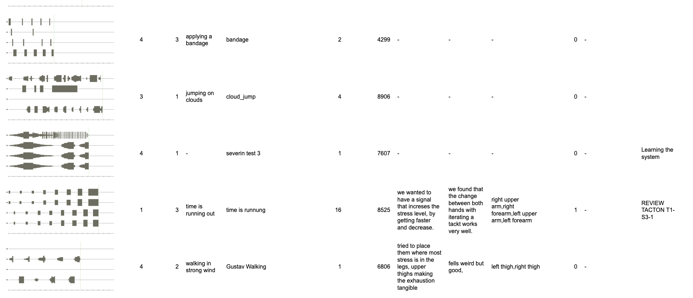

# Collabjam Tacton Table Tool

This website can be used to look and filter through the data created in the CollabJam CHI 2025 study. The tool is based on [Jekyll](https://jekyllrb.com/) and [Datatables](https://datatables.net/).

## Run

To run this tool, simply open the `./_site/index.html` file in a web-browser.
[Install Jekyyl](https://jekyllrb.com/docs/) to develop and serve the website.

## Data

The dataset is based on the tacton metadata created in the latest study and was transformed to csv tabular data.

- `metadata.csv` contains the unaltered data from CollabJam application (but obviously transformed to csv)
- `metadata_w_img.csv` simply adds the paths to a screenshot to each tacton. The path is within an image tag, which is needed to render the screenshots in the tool.
- **`metadata_w_img_renamed.csv`** includes changes to the prompts and adds comments to the data based on a manual data/video review.
  - Added prompt values for most tactons (based on tacton name, visual inspection and video review)
  - Added comments for :ij
    - Tactons chosen for review (REVIEW-TACTON ....)
    - When the intention/prompt was unclear
    - When the tacton was just used to check functionality of the system or for learning the system 